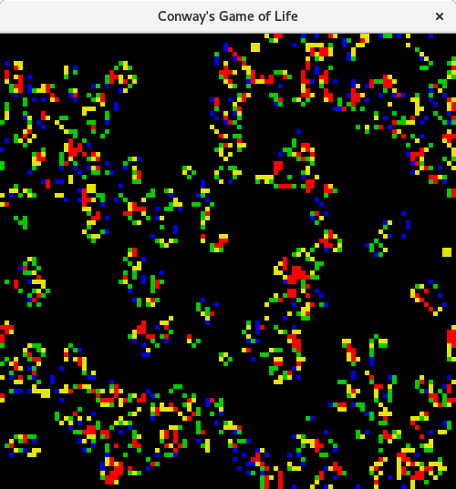
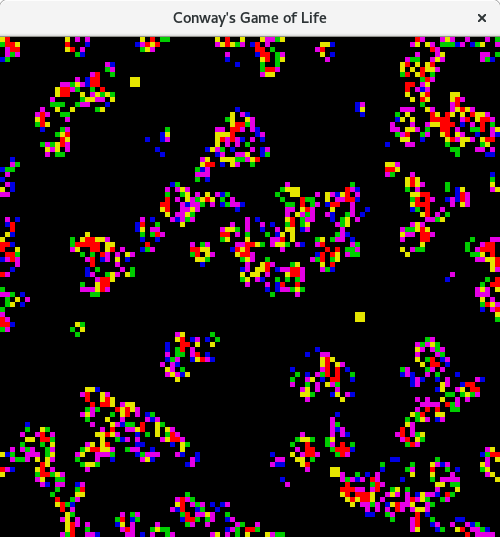
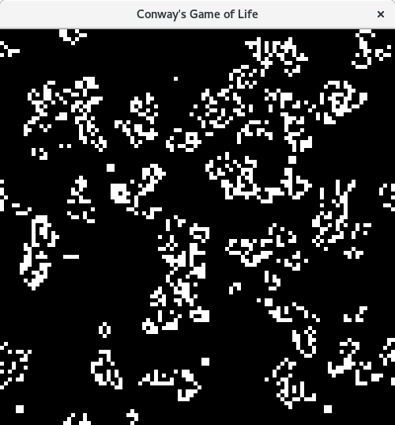
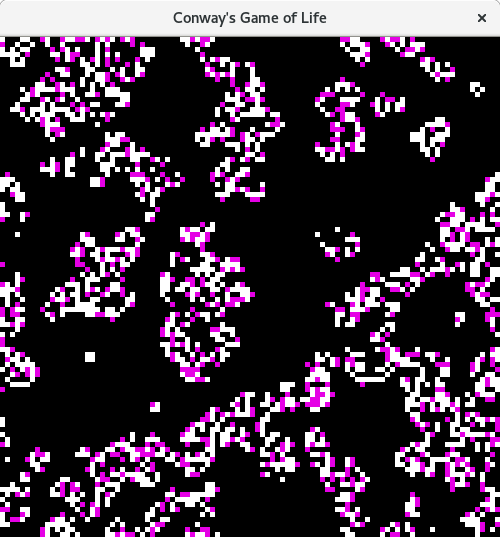
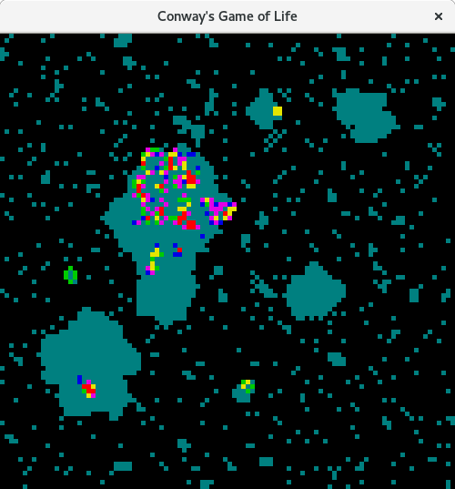
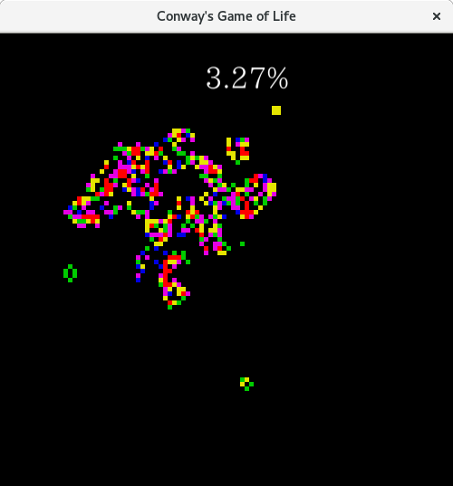

# Prerequisites for golang-conway-heat
Install the go language for your platform.
Configure your home directory for go.

# Running golang-conway-heat
 cd 
 mkdir -p go/src/
 go get github.com/wrightrocket/golang-conway-heat
 cd github.com/wrightrocket/golang-conway-heat
 go build
 ./golang-conway-heat

# golang-conway-heat
Conway's Game of Life written in Go with heat map color to show neighbor density 
By default, the game will the following colors according to the number of neighbors:
 
<ul>
<li>1 -> blue
<li>2 -> green
<li>3 -> yellow
<li>4 or more -> red
<li>next alive -> purple
<li>previously alive -> aqua
</ul>
<h2>Using the keyboard</h2>
While the game is running you can press the follow keys to toggle:
<ul>
<li>c - show alive cells in blue, green, yellow or red
<li>l - show previously alive cells in aqua
<li>n - show next alive cell in purple
<li>p - draw percent alive
<li>r - change report output
</ul>

<h3>To exit the game press q or ESC</h3>

<h2>Using -color=true -next=false</h2>

<h2>Using -color=true -next=true</h2>

<h2>Using -color=false -next=false</h2>

<h2>Using -color=false -next=true</h2>

<h2>Using -lived=true</h2>

<h2>Using -percent=true</h2>

 

<pre>
Usage of ./golang-conway-heat:
  -c	Same as -color. (default true)
  -color
    	If true, the number of neighbors a live cell is colored red > 3, yellow = 3, green = 2, and blue = 1. If false, then live cells will appear white. (default true)
  -d string
    	Same as -delay. (default "5s")
  -delay string
    	Sets the amount of time to delay at the end of the game. (default "5s")
  -e string
    	Same as -expire. (default "0d0h0m0s")
  -expire string
    	Sets the amount of time to run the game. When -expire is a zero duration, it removes any time constraint. (default "0d0h0m0s")
  -f int
    	Same as -fps. (default 5)
  -fps int
    	Sets the frames-per-second, used set the speed of the simulation. (default 5)
  -g int
    	Same as -grid. (default 100)
  -grid int
    	Sets both the number of rows and columns for the game grid. (default 100)  
  -l	Same as -lived. (default true)
  -lived
    	Show cells that have lived in aqua color. (default true)    
  -n	Same as -next. (default true)
  -next
    	Boolean to determine if next alive cell is shown as a purple color.  (default true)
  -o float
    	Same as -odds. (default 0.15)
  -odds float
    	A percentage between 0 and 1 to determine if a cell starts alive. For example, 0.15 means each cell has a 15% chance of starting alive. (default 0.15)
  -p	Same as -percent. (default true)
  -percent
    	Draw percent alive (default true)
  -r int
    	Same as -report.
  -report int
    	Sets the output report. 1: detailed, 2: comma separated, 3: space separated, 4: round number and alive percentage. The default is no output.
  -s int
    	Same as -seed. (default 1541101028575867724)
  -seed int
    	Sets the starting seed of the game, used to randomize the initial state. (default 1541101028575867724)
  -t int
    	Same as -turns
  -turns int
    	Integer for how many turns to execute. When -turns is zero, it removes any constraint on the number of turns.

</pre>
